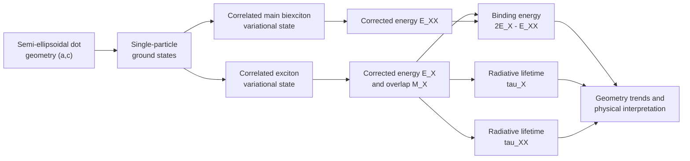

# Paper Outline: Main Biexcitonic State

**Status:** Updated after completion of the final seven-geometry raw
importance-sampled calculation and the production plots, 2026-08-03.

The source-of-truth working notes are:

- `../00-theory/Computational Design Log.md` for the final numerical method;
- `Main-State Results Note.md` for numerical values, interpretation, and
  draft figure captions;
- `../01-numerics/main-state-final-summary-meV.csv` for the machine-readable
  final results.

## Working scope

The paper studies only the ground exciton $X$ and the main biexcitonic state
$XX$ in a strongly oblate semi-ellipsoidal quantum dot. The central question
is how the dot dimensions $a$ and $c$ control:

1. the corrected biexciton energy $E_{XX}$;
2. the biexciton binding energy $E_{\mathrm{bind}}=2E_X-E_{XX}$;
3. the exciton and biexciton radiative lifetimes, $\tau_X$ and $\tau_{XX}$.

The required microscopic quantities are the corrected exciton and biexciton
energies and the ground-exciton coincidence overlap $M_X$.

### Explicitly outside the scope

- Excited exciton or biexciton configurations
- Exchange fine structure
- Extended selection-rule diagrams
- Dark-state islands and cascade networks
- Trions
- Third-order susceptibility and nonlinear absorption

These subjects can be reserved for later papers.

## Possible titles

1. *Geometry Dependence of the Main Biexcitonic State in Strongly Oblate Semi-Ellipsoidal Quantum Dots*
2. *Biexciton Binding and Radiative Lifetimes in Strongly Oblate Semi-Ellipsoidal Quantum Dots*
3. *Confinement-Controlled Biexciton Binding and Radiative Decay in Semi-Ellipsoidal Quantum Dots*

The second title is the most direct match to the planned results.

## Narrative scheme

## Proposed manuscript structure

### Abstract

Write the abstract as five compact elements:

1. **Context:** biexciton binding and radiative decay are important for
   two-photon emission and exciton–biexciton cascades.
2. **Model:** strongly oblate semi-ellipsoidal quantum dot with correlated
   variational exciton and biexciton wave functions.
3. **Method:** ground-orbital importance sampling, adaptive quasi-Monte Carlo
   integration of the raw estimator, and safeguarded local coordinate pattern
   searches over seven representative geometries.
4. **Results:** axial confinement produces the dominant shift of $E_{XX}$;
   increasing either semiaxis weakens the binding and increases the oscillator
   strength, thereby shortening both lifetimes.
5. **Conclusion:** the main state is resolved as bound for all sampled
   geometries except $(10,1)$, where the positive binding is marginal at the
   present rough numerical resolution.

The abstract may quote the final numerical ranges, but it must describe the
$(10,1)$ result as marginal rather than as firmly resolved binding.

### 1. Introduction

#### 1.1 Physical motivation

- Briefly introduce excitons and biexcitons in semiconductor quantum dots.
- Explain why the biexciton binding energy affects spectral line ordering and
  the exciton–biexciton radiative cascade.
- Motivate radiative lifetimes as experimentally relevant observables.

#### 1.2 Role of quantum-dot geometry

- Explain why lateral and axial confinement need not affect Coulomb
  correlations in the same way.
- Motivate the strongly oblate semi-ellipsoidal geometry as a model for
  flattened or dome-shaped dots.
- Distinguish the present geometry from full ellipsoidal and spherical models.

#### 1.3 Objective and contribution

State clearly that the paper:

- considers only the ground exciton and main biexciton;
- calculates correlated $E_X$ and $E_{XX}$;
- evaluates $E_{\mathrm{bind}}=2E_X-E_{XX}$;
- obtains $M_X$, $\tau_X$, and $\tau_{XX}$;
- studies separate $a$- and $c$-dependence;
- explicitly verifies whether the small binding energy is numerically
  resolved.

End the introduction with a short map of the remaining sections.

### 2. Model and theoretical framework

#### 2.1 Quantum-dot geometry and material model

- Define the semi-ellipsoidal confinement domain and semiaxes $a$ and $c$.
- State the strong-oblate condition $c/a\ll1$.
- Introduce the effective-mass and dielectric approximations.
- Define the hard-wall confinement and the energy/length units.
- List the electron and hole material parameters in a table.

#### 2.2 Ground single-particle states

- Summarize the adiabatic separation of axial and in-plane motion.
- Give the ground-state orbital and single-particle energy.
- Explain why only the lowest electron and hole states enter this paper.

Keep detailed derivations out of the main text; place them in an appendix or
cite the established model.

#### 2.3 Correlated ground-exciton state

- Define the uncorrelated electron–hole product.
- Introduce the Jastrow correlation factor
  $F_X=\exp(-\alpha r_{eh})$.
- Define the normalization $N_X$.
- Present
  $$
  E_X=E_X^{(0)}+\Delta E_X.
  $$
- Define the normalized coincidence overlap
  $$
  M_X=\frac{1}{\sqrt{N_X}},
  \qquad |M_X|^2=\frac{1}{N_X}.
  $$

#### 2.4 Correlated main-biexciton state

- Define the two-electron–two-hole Hamiltonian.
- Introduce the symmetrized main-biexciton correlation factor
  $F_{XX}=G(P+Q)$.
- Define the four variational parameters
  $(\alpha,\beta,\gamma,\delta)$.
- Briefly identify direct and exchange/cross contributions to the norm,
  interaction, and kinetic energies.
- Present
  $$
  E_{XX}=E_{XX}^{(0)}+\Delta E_{XX}.
  $$

Only the formulas needed to reproduce the calculated main-state energy should
remain in the main text. Long derivative kernels belong in an appendix or the
supplement.

#### 2.5 Binding-energy definition

Define the sign convention prominently:

$$
E_{\mathrm{bind}}=2E_X-E_{XX}
                  =2\Delta E_X-\Delta E_{XX}.
$$

With this convention:

- $E_{\mathrm{bind}}>0$: bound biexciton;
- $E_{\mathrm{bind}}<0$: antibound biexciton.

Emphasize that the single-particle contribution cancels exactly, making the
binding energy a small difference between much larger correlation corrections.

#### 2.6 Radiative lifetimes

- Define
  $f_X=(E_P/E_{\mathrm{exc}})|M_X|^2$ with
  $E_{\mathrm{exc}}=E_g+E_X$, converting the stored $E_X$ from meV to eV.
- Give the exciton radiative-lifetime formula and the adopted main-biexciton
  relation $\tau_{XX}=\tau_X/4$.
- Explain that the factor of four follows from the cited decay-channel
  convention and is not an independently calculated geometry dependence.
- State the optical parameter set
  $E_g=1.5192\ \mathrm{eV}$, $m_e=0.0665m_0$,
  $E_P=22.71\ \mathrm{eV}$, and
  $\epsilon_r^{(\mathrm{opt})}=12.91$.
- Explicitly distinguish these optical constants from the slightly different
  $m_e$ and dielectric constant used to define the energy units.
- Cite and follow the lifetime definitions in:
  *Biexciton, negative and positive trions in strongly oblate ellipsoidal
  quantum dots*.

The plotted confinement energies exclude the band gap, whereas the optical
transition energy used in the lifetime formula includes it.

### 3. Numerical method and validation

#### 3.1 Geometry set

Lengths are given in effective Bohr radii:

| Scan | Geometries $(a,c)$ |
|---|---|
| Axial-confinement scan | $(5,0.5)$, $(5,1)$, $(5,1.5)$, $(5,2)$ |
| Lateral-confinement scan | $(3,1)$, $(5,1)$, $(7,1)$, $(10,1)$ |

The shared point $(5,1)$ connects the two scans.

#### 3.2 Variational minimization

- Describe the final optimizer as a safeguarded local coordinate pattern
  search, not gradient descent and not the earlier noisy Nelder–Mead search.
- Use the completed reduced-production optimum at each same geometry only as
  the initial center; evaluate every final candidate with the raw estimator.
- For $X$, evaluate a five-point one-dimensional stencil and a half-step
  refinement at $2\times10^6$ points per integral.
- For $XX$, evaluate the center and eight coordinate displacements at
  $10^6$ points per integral, then verify the center and best candidate at
  $2\times10^6$ points.
- Accept an $XX$ move only when it is lower at both budgets and the verified
  improvement exceeds
  $\max(0.02\ \mathrm{Ry},
  |\Delta E_{2\mathrm{M}}-\Delta E_{1\mathrm{M}}|)$.
- Refine only the two most promising coordinate directions with half steps
  and apply the same high-budget acceptance safeguard.
- State the positivity bounds for $\alpha$, $\beta$, and $\delta$, and the
  interval used for $\gamma$.
- Explain the eight-subkernel global candidate queue, per-integral timing, and
  restartable WXF/CSV checkpointing.

#### 3.3 Importance-sampled integral evaluation

- Summarize the ground-orbital-matched radial and axial importance
  transformation and the inherited numerical cutoff $R=0.9a$.
- State that the exciton Jastrow kinetic correction is analytical; only its
  Coulomb numerator and normalization are integrated.
- For $XX$, integrate one complete Hamiltonian-correction numerator $H$ and
  one norm denominator $N$ as separate, independently adaptive calls.
- Retain the complete raw $G(P+Q)$ expression, all six Coulomb terms, and all
  four kinetic terms point by point.
- Remove only the redundant global rotation by fixing $\phi_a=0$, restoring
  its factor $2\pi$, and integrating the other three angles independently over
  $[0,2\pi]$.
- State explicitly that there is no reflection folding, particle-exchange
  multiplicity, fixed shared Sobol set, or other production symmetry
  reduction.
- Give the Wolfram Language settings:
  `"AdaptiveQuasiMonteCarlo"`, `"BisectionDithering" -> 0`,
  `AccuracyGoal -> Infinity`, `PrecisionGoal -> 4`, and the stage-dependent
  `MaxPoints` budget.
- Explain that `NIntegrate::maxp` means the requested relative goal was not
  reached before the point cap; it does not mean that no integral value was
  returned.

#### 3.4 Validation history and production diagnostics

- Use the exact exciton normalization identity at $\alpha_X=0$.
- Summarize the comparison between the unreduced four-angle estimator and the
  final global-rotation-fixed raw estimator; they agree within the observed
  numerical resolution, while the latter is cheaper.
- Retain the earlier particle-relabeling, reflection-folding, and reduced
  direct/cross tests as validation history explaining why those reductions
  were removed from production.
- For every production $H$ and $N$ integral, record the value, internal error
  estimate, elapsed time, warning text, and whether `MaxPoints` was reached.
- Report the recorded campaign scale: 22 pilot candidates for $(5,1)$, 133
  candidates for the remaining geometries, and about 47.6 hours of recorded
  wall-clock execution across the two runs with eight workers.

The old identity spread is not the final error bar. The plotted bars are
first-order propagations of the adaptive integrator's internal error estimates.
They are rough numerical-resolution indicators, not confidence intervals, and
they omit covariance, systematic QMC bias, and parameter-location uncertainty.

#### 3.5 Resolution of the binding energy

Because the binding energy is the small difference

$$
E_{\mathrm{bind}}=2\Delta E_X-\Delta E_{XX},
$$

propagate the rough integration errors as

$$
\sigma_{\mathrm{bind}}=
\sqrt{(2\sigma_X)^2+\sigma_{XX}^2}.
$$

For all geometries except $(10,1)$, the positive binding energy is
substantially larger than this rough resolution estimate. At $(10,1)$,
$E_{\mathrm{bind}}=0.170\pm0.109\ \mathrm{meV}$, so the result must be
reported as marginally positive rather than as firmly resolved binding.

### 4. Results and discussion

#### 4.1 Exciton and biexciton correlation energies

- Present the corrected $E_X$ and $E_{XX}$ values and rough errors in the main
  results table; place the single-particle/correlation decomposition in the
  supplement if space is limited.
- State that these plotted energies exclude the material band gap.
- Keep the main graphical emphasis on $E_{XX}$ and use the component
  decomposition only to explain the confinement trend and binding-energy
  cancellation.

#### 4.2 Main-biexciton energy versus geometry

**Figure 1: $E_{XX}$ versus geometry**

- Panel (a): $E_{XX}$ versus $c$ at fixed $a=5$.
- Panel (b): $E_{XX}$ versus $a$ at fixed $c=1$.
- Use corrected energies excluding the band gap.
- Report that increasing $c$ from $0.5$ to $2$ at fixed $a=5$ lowers
  $E_{XX}$ from $498.81$ to $20.44\ \mathrm{meV}$, a factor of $24.4$.
- Contrast this with the fixed-$c=1$ scan, where increasing $a$ from $3$ to
  $10$ lowers $E_{XX}$ by only $7.9\%$, from $121.41$ to
  $111.79\ \mathrm{meV}$.
- Conclude that the short axial dimension is the dominant control of the
  absolute biexciton energy.

#### 4.3 Binding energy versus geometry

**Figure 2: $E_{\mathrm{bind}}$ versus geometry**

- Panel (a): $E_{\mathrm{bind}}$ versus $c$ at fixed $a=5$.
- Panel (b): $E_{\mathrm{bind}}$ versus $a$ at fixed $c=1$.
- Draw the zero-binding reference line.
- Show the finalized rough propagated numerical-resolution bars.
- Report the axial decrease from $1.472\pm0.122$ to
  $0.575\pm0.077\ \mathrm{meV}$ and the lateral decrease from
  $1.385\pm0.088$ to $0.170\pm0.109\ \mathrm{meV}$.
- State that all central values are positive; binding is resolved by the rough
  diagnostic at every geometry except $(10,1)$, where it is only marginal.
- Avoid calling the bars confidence intervals or quoting their ratios as
  statistical significance.

This section should be the numerical and interpretive center of the paper.

#### 4.4 Optimized correlation parameters

- Put the complete optimized $\alpha_X$ and
  $(\alpha,\beta,\gamma,\delta)_{XX}$ table in the supplement.
- Note that $\beta$ becomes very small for $c=1.5$ and $2$.
- Discuss the smooth increase of $\gamma/\delta$, the maximum of the isolated
  hole-hole factor $r_{ab}^{\gamma}e^{-\delta r_{ab}}$, as either dot
  dimension increases.
- Avoid overinterpreting small changes in individual parameters because the
  objective is numerically rough and the search is local.

#### 4.5 Exciton overlap and oscillator-strength trend

- Present $N_X$, $M_X$, and $|M_X|^2$.
- Explain that no additional overlap integral is needed:
  $M_X=1/\sqrt{N_X}$ and $|M_X|^2=1/N_X$.
- Report that $|M_X|^2$ increases from $4.167$ to $8.543$ along the axial
  scan and from $4.294$ to $11.169$ along the lateral scan.
- Keep the overlap and oscillator strength in the main numerical table and
  discussion; no separate main-text figure is required because their physical
  effect is already visible in the lifetime plot.

#### 4.6 Radiative lifetimes versus geometry

**Figure 3: $\tau_X$ and $\tau_{XX}$ versus geometry**

- Panel (a): both lifetimes versus $c$ at fixed $a=5$.
- Panel (b): both lifetimes versus $a$ at fixed $c=1$.
- Use consistent colors and markers for $X$ and $XX$.
- Report that $\tau_X$ decreases from $2.548$ to $1.437\ \mathrm{ps}$ along
  the axial scan and from $2.767$ to $1.068\ \mathrm{ps}$ along the lateral
  scan.
- Explain that the increase in $|M_X|^2$ outweighs the decrease in transition
  energy, so the oscillator strength increases and the lifetime shortens.
- State explicitly that $\tau_{XX}=\tau_X/4$ by the adopted convention; the
  biexciton values span $0.692$ to $0.267\ \mathrm{ps}$.
- Note that the propagated lifetime errors are smaller than the plotted
  symbols.

#### 4.7 Combined physical interpretation

Connect the three result groups:

- confinement changes the single-particle and correlation energies;
- their cancellation controls the small biexciton binding energy;
- the exciton coincidence overlap controls the oscillator strength;
- the transition energy and oscillator strength together control the
  radiative lifetimes.

- Identify $c$ as the dominant control of the absolute energy scale.
- Emphasize that increasing either dimension weakens binding, while lateral
  enlargement produces the strongest relative suppression over the sampled
  range.
- Connect the decreasing exciton norm to the increasing coincidence overlap,
  increasing oscillator strength, and decreasing lifetimes.

#### 4.8 Comparison and limitations

- Compare qualitative trends and lifetime scales with the reference
  ellipsoidal-dot calculation.
- Discuss the semi-ellipsoidal boundary and hard-wall approximation.
- Note the effective-mass and dielectric assumptions.
- State explicitly that the $(10,1)$ binding is marginal and that the rough
  error bars omit systematic QMC and parameter-location uncertainty.
- Mention the local character of the pattern search and avoid presenting the
  optimized parameter coordinates as uniquely determined.
- Avoid claims about excited complexes or nonlinear optical response.

### 5. Conclusions

The conclusion should make four direct statements:

1. $E_{XX}$ decreases as either semiaxis increases, but the axial dimension
   controls the absolute energy much more strongly.
2. The main biexciton is resolved as bound at all sampled geometries except
   $(10,1)$; the small positive binding there is marginal at the present
   resolution.
3. Increasing either semiaxis enhances the exciton coincidence overlap and
   shortens both lifetimes, with $\tau_{XX}=\tau_X/4$ under the adopted
   radiative convention.
4. Axial confinement is the most effective control of the absolute energy,
   whereas lateral enlargement strongly suppresses the binding and enhances
   the oscillator strength across the sampled range.

End with one restrained outlook sentence on extensions to excited complexes,
finite barriers, or comparison with experiment.

## Figures and tables

### Main-text figures

1. **Model schematic:** semi-ellipsoidal dot and definitions of $a$ and $c$
   (optional if the geometry is already standard in the target journal).
2. **Figure 1:** corrected $E_{XX}$ versus $c$ and $a$
   (`../03-figures/Main-E_XX.pdf`).
3. **Figure 2:** $E_{\mathrm{bind}}$ versus $c$ and $a$, including
   numerical resolution (`../03-figures/Main-Binding-Energy.pdf`).
4. **Figure 3:** $\tau_X$ and $\tau_{XX}$ versus $c$ and $a$
   (`../03-figures/Main-Lifetimes.pdf`).

### Main-text tables

1. Material and model parameters.
2. Compact numerical results for the seven geometries, including
   $E_X$, $E_{XX}$, $E_{\mathrm{bind}}$, $N_X$, $|M_X|^2$, $f_X$,
   $\tau_X$, and $\tau_{XX}$.

### Supplementary material

- Optimized variational parameters for every geometry
- Decomposition of the X and XX correlation energies
- Validation history comparing reduced and raw estimators
- Per-integral warnings, rough errors, timing, and integration-budget results
- Detailed derivative kernels and raw-integral formulas
- Archived reduced-estimator derivations, clearly identified as validation
  history rather than the production method
- Machine-readable result tables

## Writing order

With the method and results notes now complete, the recommended drafting order
is:

1. Section 3 from the Computational Design Log
2. Section 4 and the captions from the Main-State Results Note
3. Section 2: model and formulas
4. Section 5: conclusions
5. Section 1: introduction
6. Abstract and final title

The final numerical claims and their resolution caveats are now fixed; they
should be copied consistently into the abstract, results, and conclusions.

## Resolved items and remaining decisions

- [x] Complete the $(5,1)$ convergence and raw-estimator trials.
- [x] Select the final raw estimator with only the global rotation removed.
- [x] Replace noisy unconstrained minimization with the safeguarded
      $10^6/2\times10^6$ pattern-search protocol.
- [x] Complete the refined seven-geometry campaign.
- [x] Propagate rough numerical errors and attach them to all production plots.
- [x] Classify the $(10,1)$ binding as marginal rather than requiring a firm
      sign claim.
- [x] Confirm the lifetime formulas, optical constants, and
      $\tau_{XX}=\tau_X/4$ convention.
- [x] Keep the overlap quantities in the main numerical table and discussion;
      do not require a separate overlap figure.
- [ ] Select the target journal and adapt section lengths and citation style.
- [ ] Decide whether the optional model schematic is needed.
- [ ] Write the comparison with the reference ellipsoidal-dot calculation.

No additional numerical run is required for the present restrained claims.
A targeted higher-resolution calculation at $(10,1)$ is optional only if the
paper must make a firm bound-versus-antibound statement at the largest dot.
